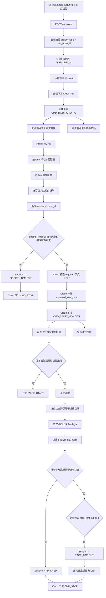

# 智慧操场跑步项目：云端交接文档（JS 同事）

## 1. 文档目的

这份文档是给接手云端工作的 JS 同事准备的正式交接材料，目标是让你在不反复翻代码的情况下，快速搞清楚：

- 业务到底要做什么
- 小程序应该传什么，不应该传什么
- 云端当前已经实现了什么
- 云端下一步应该继续收哪些能力
- 边缘节点现在会怎样配合云端

如果你只看一份文档，建议优先看这份。

---

## 2. 项目背景

这是一个智慧操场跑步项目，使用固定安装机位的边缘节点完成：

- 起点现场身份识别
- 抢跑检测
- 终点冲线检测
- 成绩汇总

老师在小程序上只做“教学控制”，例如：

- 选择项目
- 选择起点机位
- 发起一轮任务
- 查看运行状态
- 查看成绩结果

**关键原则：**

- 小程序不负责现场识别
- 小程序不负责指定每条跑道是谁
- 小程序不负责计算终点机位
- 这些工作都应该由云端和边缘共同完成

---

## 3. 操场机位示意图

下图是当前确认使用的操场机位方案图：


图中可以这样理解：

- `组1 / 组2 / 组3`：左侧三组固定机位
- `组4 / 组5 / 组6`：右侧三组固定机位
- `组7`：下方机位
- `组8`：上方机位

这张图的作用是表达：

- 小程序里老师不是直接选“任意摄像头”
- 而是按“项目 + 起点方案组”发起任务
- 云端再根据规则自动推导终点方案组和参与节点

需要特别注意：

- 这张图是**操场机位布局图**
- 不是跑道 polygon 标定图
- 也不是起跑线/终点线标定图

后续每个参与机位仍然要各自维护：

- 跑道 polygon 标定文件
- 起跑线标定文件
- 终点线标定文件

---

## 4. 小程序与云端的职责边界

## 4.1 小程序负责什么

小程序只负责老师侧控制：

- 选择项目类型
- 选择起点机位
- 发起任务
- 查看当前任务状态
- 查看最终结果
- 后续可加：手动停止 / 强制作废 / 强制发车

## 4.2 小程序不负责什么

小程序**不应该**上传：

- `bindings`
- `student_id`
- `feature_id`
- `finish_node_id`
- `tracking_node_ids`
- `lane_count`
- `sync_time_ms`

原因很简单：

- 这些信息老师不知道
- 小程序也无法从现场实时感知
- 这些属于云端编排和边缘识别逻辑

## 4.3 云端负责什么

云端负责：

- 校验项目与起点机位是否合法
- 自动推导终点机位
- 创建 session
- 给起点/终点节点下发命令
- 等待起点完成绑定
- 统一发车
- 汇总起跑违规与终点成绩
- 输出 diagnostics / results

---

## 5. 项目与机位映射规则

当前系统内置了如下映射规则：

| 项目 | 可选起点机位 | 终点机位 |
|---|---|---|
| 50m | 1 或 4 | `1 -> 2`，`4 -> 5` |
| 100m | 1 或 4 | `1 -> 3`，`4 -> 6` |
| 200m | 7 或 8 | `7 -> 6`，`8 -> 3` |
| 400m | 7 或 8 | `7 -> 3`，`8 -> 6` |
| 800m | 7 或 8 | `7 -> 3`，`8 -> 6` |
| 1000m | 1 或 4 | `1 -> 6`，`4 -> 3` |

### 说明

- 800m / 1000m 后续会涉及套圈逻辑
- 当前云端接口已经支持项目 + 起点机位校验
- 非法组合会直接返回 `400`

---

## 6. 当前云端接口契约

## 6.1 创建任务

### 请求

`POST /sessions`

### 当前请求体

```json
{
  "project_type": "200m",
  "start_node_id": 7,
  "auto_start": true,
  "binding_timeout_sec": 15,
  "start_delay_ms": 5000,
  "countdown_seconds": 3,
  "race_timeout_sec": 120
}
```

### 解释

- `project_type`
  - 必填
  - 当前支持：`50m / 100m / 200m / 400m / 800m / 1000m`
- `start_node_id`
  - 必填
  - 云端据此推导终点机位
- `auto_start`
  - 是否在 ready 后自动发车
- `binding_timeout_sec`
  - 绑定超时
- `start_delay_ms`
  - all ready 后到正式发车之间的缓冲时间
- `countdown_seconds`
  - 倒计时秒数
- `race_timeout_sec`
  - 比赛超时

## 6.2 创建成功响应

示例：

```json
{
  "session_id": "RUN_20260331_120000_123",
  "status": "CREATED",
  "created_at": "2026-03-31T12:00:00.123456",
  "project_type": "200m",
  "lane_count": 8,
  "start_node_id": 7,
  "finish_node_id": 6,
  "tracking_node_ids": [],
  "bindings": [],
  "candidate_lanes": [1, 2, 3, 4, 5, 6, 7, 8],
  "active_lanes": [],
  "binding_mode": "DISCOVER",
  "sync_time_ms": null,
  "require_bindings": true,
  "auto_start": true,
  "binding_timeout_sec": 15,
  "start_delay_ms": 5000,
  "countdown_seconds": 3,
  "race_timeout_sec": 120,
  "audio_plan": "START_321_GO",
  "tracking_active": true,
  "expected_start_time": null,
  "finished_at_ms": null,
  "terminal_reason": null
}
```

## 6.3 非法组合响应

例如：

- `project_type=200m`
- `start_node_id=1`

响应：

```json
{
  "detail": "invalid start_node_id=1 for project_type=200m; allowed: [7, 8]"
}
```

---

## 7. 当前状态与结果接口

## 7.1 状态诊断

`GET /sessions/{session_id}/diagnostics`

这个接口给调试和前端状态展示都很重要。

建议前端重点读取：

- `session.status`
- `workflow.init_sent_to`
- `workflow.binding_sent_to`
- `workflow.start_sent`
- `workflow.stop_sent`
- `readiness.all_ready`
- `warnings`
- `nodes[].last_status`
- `nodes[].last_ack`
- `nodes[].last_id_report`
- `nodes[].last_violation`
- `nodes[].last_finish`

### 特别重要的节点字段

起点节点的 `last_status.data` 里，重点看：

- `session_stage`
- `binding_required`
- `binding_ready`
- `binding_target_lanes`
- `binding_candidate_lanes`
- `binding_observed_lanes`
- `binding_confirmed_lanes`
- `binding_assignments`
- `last_face_ts`
- `lane_layout_status`
- `start_line_status`

终点节点重点看：

- `session_stage`
- `finish_line_status`
- `lane_layout_status`
- `camera_ready`

## 7.2 结果接口

`GET /sessions/{session_id}/results`

这个接口是给前端结果页直接消费的。

每条跑道会有：

- `lane`
- `student_id`
- `recognized_name`
- `recognized_confidence`
- `finish_ts`
- `elapsed_ms`
- `rank`
- `false_start`
- `false_start_detail`
- `result_status`

### `result_status` 目前定义

- `OK`
- `FALSE_START`
- `DNF`
- `UNBOUND`
- `WAIT_BINDING`
- `RUNNING`

---

## 8. 当前端到端业务流



---

## 9. 边缘节点当前真实职责

## 9.1 起点节点

当前起点节点负责：

- 绑定阶段：
  - 观察哪些跑道有人
  - 识别跑道上的学生是谁
- 发车前：
  - 倒计时
  - 检测脚踝是否越过起跑线

### 当前识别方式

不是整帧识别人脸，而是：

1. 先检测人体框
2. 再按跑道分 lane
3. 再把人体框 crop 送百度搜索
4. 成功后不再重复查
5. 失败最多尝试 3 次

## 9.2 终点节点

当前终点节点负责：

- 监控目标
- 判断左右脚踝是否过终点线
- 首次过线时记录 `finish_ts`
- 上报 `FINISH_REPORT`

---

## 10. 当前超时与退出机制

### 10.1 绑定超时

如果起点在 `binding_timeout_sec` 内未完成有效绑定：

- `session.status = BINDING_TIMEOUT`
- 云端自动下发 `CMD_STOP`

### 10.2 比赛超时

如果比赛开始后，在 `race_timeout_sec` 内未收齐终态：

- `session.status = RACE_TIMEOUT`
- 未完成跑道记为 `DNF`
- 云端自动下发 `CMD_STOP`

### 10.3 正常结束

如果所有参与跑道都已进入终态：

- `session.status = FINISHED`
- 云端自动下发 `CMD_STOP`

---

## 11. 当前已经完成的云端能力

截至目前，云端已经实现：

- 新的 session 创建入口
- 项目/起点合法性校验
- 自动推导终点机位
- 自动编排：
  - `CMD_INIT`
  - `CMD_BINDING_SYNC`
  - `CMD_START_MONITOR`
- 绑定超时和比赛超时
- diagnostics 汇总
- results 汇总
- 标定 warning 汇总

---

## 12. 当前还没完全做完的云端能力

下面这些是下一阶段更值得继续做的：

### 12.1 `tracking_node_ids` 自动推导

目前已留接口位，但规则还没正式接入。

### 12.2 套圈逻辑

`800m / 1000m` 还需要补：

- 圈数统计
- 中途状态
- 多次过点确认

### 12.3 裁判控制点

建议后续补：

- 强制发车
- 强制停止
- 强制作废
- 强制通过绑定

### 12.4 前端状态文案映射

目前已有技术状态，但前端还需要一层展示映射，例如：

- `CREATED`
- `BINDING`
- `READY`
- `COUNTDOWN`
- `RUNNING`
- `FINISHED`
- `BINDING_TIMEOUT`
- `RACE_TIMEOUT`

---

## 13. 前端对接建议

给小程序同学最重要的建议只有两条：

### 1. 只传项目和起点

不要再传任何“谁在哪条跑道”的信息。

### 2. 一切状态都以云端返回为准

前端不要自己猜：

- 是否 ready
- 是否已经发车
- 哪条跑道有没有人
- 哪条跑道对应谁

这些都由 `diagnostics` 和 `results` 返回。

---

## 14. 相关文档

如果需要继续深挖，可以再看：

- 需求说明：`docs/mini_program_track_requirements.md`
- 接口示例：`docs/mini_program_api_examples.md`
- Postman 集合：`docs/protocols/postman_collection.json`
- 运行协议草案：`docs/protocols/run_protocol.md`

---

## 15. 对 JS 同事的建议落点

如果你接下来要继续做云端，建议优先顺序如下：

1. 先按当前 `POST /sessions` 契约把前端调用接通
2. 用 `diagnostics` 驱动状态页
3. 用 `results` 驱动成绩页
4. 再做 `tracking_node_ids` 自动推导
5. 再做套圈逻辑
6. 最后补人工控制点

这样推进最稳，也最不容易推翻现有链路。
