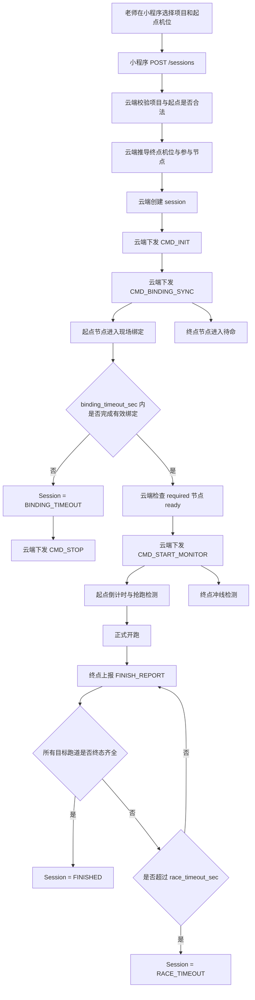

# 智慧操场跑步项目：小程序到云端需求说明

## 1. 文档目的

本文档用于统一“小程序 -> 云端 -> 边缘节点”在智慧操场跑步项目中的职责边界、机位规则、接口格式与业务流程，供：

- 小程序开发
- 云端开发
- 边缘节点开发
- 测试与现场实施

共同对齐。

本文档基于当前操场机位分布草图整理，重点解决以下问题：

- 小程序不应上传 `bindings`、`student_id`、`feature_id`
- 小程序只负责“老师操作”，不承担现场识别逻辑
- 云端负责根据项目类型和起点机位自动推导终点机位与参与节点
- 起点节点负责“有人就绑定，没人就算”
- 终点节点负责冲线检测与成绩上报

---

## 2. 机位图理解与机位约定

根据当前确认使用的操场机位图，可将方案组理解为围绕操场布设的固定机位组：

- 左侧机位组：`组1 / 组2 / 组3`
- 右侧机位组：`组4 / 组5 / 组6`
- 下方机位组：`组7`
- 上方机位组：`组8`

这张图表达的是：

- 老师在小程序中按“项目 + 起点方案组”发起任务
- 云端根据项目规则自动推导终点方案组
- 不同方案组负责不同比赛项目的起终点观察

需要特别强调：

- 这张图不是跑道 polygon 标定图
- 也不是起跑线/终点线标定图
- 每个参与机位后续仍需要自己的：
  - 跑道标定文件
  - 起跑线标定文件
  - 终点线标定文件

这意味着：

- 小程序不应理解“跑道上当前是谁”
- 云端不应要求前端提前上传 `bindings`
- 每次任务开始时，应由起点机位先做现场识别

---

## 3. 项目与机位映射规则

### 3.1 支持项目

- `50m`
- `100m`
- `200m`
- `400m`
- `800m`
- `1000m`

### 3.2 起点机位与终点机位映射

| 项目 | 可选起点机位 | 终点机位推导规则 |
|---|---|---|
| 50m | 1 或 4 | `1 -> 2`，`4 -> 5` |
| 100m | 1 或 4 | `1 -> 3`，`4 -> 6` |
| 200m | 7 或 8 | `7 -> 6`，`8 -> 3` |
| 400m | 7 或 8 | `7 -> 3`，`8 -> 6` |
| 800m | 7 或 8 | `7 -> 3`，`8 -> 6`，含套圈 |
| 1000m | 1 或 4 | `1 -> 6`，`4 -> 3`，含套圈 |

### 3.3 规则说明

- 小程序只允许老师选择“项目 + 起点机位”
- 终点机位由云端自动推导
- 中间跟踪机位当前可由云端内部规则补充，前端无需传入
- 800m / 1000m 的圈数逻辑由云端负责，不由小程序承担

---

## 4. 角色职责划分

### 4.1 小程序职责

小程序只负责老师侧控制：

- 选择项目类型
- 选择起点机位
- 发起一轮任务
- 查看当前状态
- 查看结果
- 手动中止或重置任务

### 4.2 云端职责

云端负责业务编排：

- 校验“项目类型 + 起点机位”是否合法
- 根据规则自动推导终点机位与参与节点
- 创建 session
- 向相关边缘节点下发命令
- 等待起点绑定完成
- 统一发车
- 汇总违规、冲线、成绩
- 对外提供状态与结果接口

### 4.3 边缘节点职责

#### 起点节点

- 绑定阶段：识别现场跑道上的学生
- 发车前：倒计时与抢跑检测
- 发车后：不再负责冲线成绩

#### 终点节点

- 发车后进入冲线检测
- 记录脚踝过终点线的时间点
- 上报 `FINISH_REPORT`

#### 其他节点

- 后续扩展为中途违规、套圈、辅助确认等用途

---

## 5. 小程序接口设计

## 5.1 小程序发给云端的最小请求

建议小程序创建任务时只传：

```json
{
  "project_type": "200m",
  "start_node_id": 7,
  "auto_start": true,
  "binding_timeout_sec": 15,
  "start_delay_ms": 5000,
  "countdown_seconds": 3,
  "race_timeout_sec": 90
}
```

### 5.2 小程序不应传入的字段

以下字段不应由小程序上传：

- `lane_count`
- `finish_node_id`
- `tracking_node_ids`
- `bindings`
- `student_id`
- `feature_id`
- `sync_time_ms`

原因：

- 这些字段属于场地编排、设备编排、现场识别结果或系统内部时间控制
- 老师和小程序无法准确感知这些信息

### 5.3 当前旧请求格式的问题

当前旧格式示例：

```json
{
  "project_type": "200m",
  "lane_count": 4,
  "start_node_id": 1,
  "finish_node_id": 2,
  "tracking_node_ids": [],
  "bindings": [
    { "lane": 2, "feature_id": "F002" }
  ],
  "auto_start": true,
  "binding_timeout_sec": 10,
  "start_delay_ms": 5000,
  "countdown_seconds": 3,
  "audio_plan": "START_321_GO",
  "tracking_active": true,
  "sync_time_ms": 1738416000000
}
```

该格式的问题是：

- 让小程序承担了设备编排逻辑
- 让小程序承担了现场人员绑定逻辑
- 不符合“有人就绑定，没人就算”的现场运行模式

---

## 6. 云端创建任务后的处理规则

### 6.1 云端推导逻辑

云端收到小程序请求后，应自动完成：

1. 校验项目类型是否合法
2. 校验起点机位是否合法
3. 根据项目类型和起点机位推导：
   - `finish_node_id`
   - `tracking_node_ids`
4. 创建 session
5. 记录本轮任务配置

### 6.2 session 内部建议字段

云端内部 session 可维护：

- `session_id`
- `project_type`
- `start_node_id`
- `finish_node_id`
- `tracking_node_ids`
- `binding_timeout_sec`
- `start_delay_ms`
- `countdown_seconds`
- `race_timeout_sec`
- `status`
- `expected_start_time`
- `terminal_reason`

---

## 7. 绑定阶段业务规则

## 7.1 绑定原则

本项目采用：

**现场识别绑定**

而不是：

**前端预上传绑定名单**

### 7.2 核心规则

- 起点节点在绑定阶段观察当前可见跑道
- 哪条跑道上有人，就尝试识别哪条跑道
- 哪条跑道上没人，就不阻塞本轮任务
- 被识别成功的跑道，建立：
  - `lane -> student_id`

### 7.3 绑定完成条件

建议规则：

- 对“已检测到有人”的跑道要求完成识别
- 对“无人”的跑道不强制等待
- 绑定超时后，未识别成功的有人跑道记为未绑定

### 7.4 百度识别输入规则

边缘节点应：

1. 先检测人体框
2. 根据跑道标定判断人体属于哪条跑道
3. 从原始帧中裁出该人体框图像
4. 将该裁剪图送入百度人脸搜索
5. 已识别成功的目标不重复识别
6. 识别失败可重试限定次数

---

## 8. 发车与监控阶段业务规则

### 8.1 发车前

当起点绑定完成，且所有 required 节点 ready 后：

- 云端计算 `expected_start_time`
- 云端向起点、终点等节点下发 `CMD_START_MONITOR`

### 8.2 起点节点

起点节点在 `MONITORING` 阶段负责：

- 显示倒计时
- 检测脚踝是否在正式发车前越过起跑线
- 若越线则上报 `FALSE_START`

### 8.3 终点节点

终点节点在 `MONITORING` 阶段负责：

- 跟踪目标
- 检查左右脚踝是否跨过终点线
- 首次跨线时记录 `finish_ts`
- 上报 `FINISH_REPORT`

---

## 9. 退出与超时机制

### 9.1 绑定超时

若在 `binding_timeout_sec` 内：

- 起点节点未完成有效绑定

则：

- session 进入 `BINDING_TIMEOUT`
- 云端向节点下发 `CMD_STOP`

### 9.2 比赛超时

若比赛启动后，在 `race_timeout_sec` 内：

- 仍未获得全部目标跑道终态

则：

- session 进入 `RACE_TIMEOUT`
- 未完成跑道记为 `DNF`
- 云端向节点下发 `CMD_STOP`

### 9.3 正常结束

满足以下任一终态即可结束：

- 正常完赛 `OK`
- 抢跑 `FALSE_START`
- 超时未完赛 `DNF`

当所有参与跑道都获得终态后：

- session 进入 `FINISHED`
- 云端向节点下发 `CMD_STOP`

---

## 10. 小程序可见状态建议

建议小程序展示以下状态：

- `CREATED`
- `BINDING`
- `READY`
- `COUNTDOWN`
- `RUNNING`
- `FINISHED`
- `BINDING_TIMEOUT`
- `RACE_TIMEOUT`
- `ABORTED`

---

## 11. 小程序查看接口建议

### 11.1 查看当前轮状态

`GET /sessions/{session_id}/diagnostics`

用于展示：

- 当前处于绑定、倒计时、运行还是结束
- 起点节点是否绑定完成
- 终点节点是否在线
- 是否存在跑道标定缺失或线标定缺失 warning

### 11.2 查看最终结果

`GET /sessions/{session_id}/results`

用于展示：

- 每条跑道识别到的学生
- 是否抢跑
- 是否完赛
- 成绩时间
- 排名

---

## 12. 建议的端到端流程



---

## 13. 对小程序开发的最终要求

### 必须做到

- 只允许老师选择项目和起点机位
- 不允许小程序上传 `bindings`
- 不允许小程序上传 `finish_node_id`
- 不允许小程序上传 `tracking_node_ids`
- 不允许小程序上传学生身份信息

### 云端必须做到

- 根据项目和起点自动推导终点
- 自动编排边缘节点
- 自动绑定现场学生
- 自动判断发车时机
- 自动汇总结果

### 边缘节点必须做到

- 起点：绑定 + 抢跑
- 终点：冲线 + 成绩

---

## 14. 当前落地建议

建议云端后续将 session 创建接口逐步调整为：

```json
{
  "project_type": "200m",
  "start_node_id": 7,
  "auto_start": true,
  "binding_timeout_sec": 15,
  "start_delay_ms": 5000,
  "countdown_seconds": 3,
  "race_timeout_sec": 90
}
```

并将以下字段完全移出小程序请求：

- `lane_count`
- `finish_node_id`
- `tracking_node_ids`
- `bindings`
- `feature_id`
- `student_id`
- `sync_time_ms`

---

## 15. 后续可扩展方向

- 套圈项目的圈数统计与状态展示
- 中途机位的违规检测接入
- 小程序端手动“强制发车 / 强制停止 / 强制作废本轮”
- 根据不同操场场地切换机位映射模板
